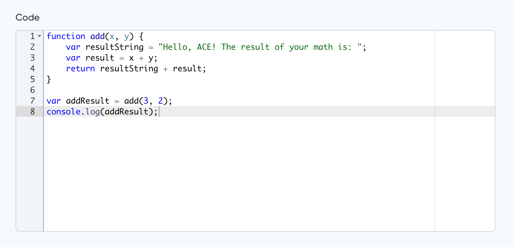

# Code field for [MoonShine Laravel admin panel](https://moonshine-laravel.com)

Extends [Textarea](https://moonshine-laravel.com/docs/resource/fields/fields-textarea) and has the same features

<picture>
    <source media="(prefers-color-scheme: dark)" srcset="./art/code_dark.png">
    <source media="(prefers-color-scheme: light)" srcset="./art/code.png">
    
</picture>

> [!NOTE]
> The package is based on the [Ace](https://ace.c9.io/) library.

---

## Compatibility

| MoonShine | Moonshine Ace | Currently supported |
|:---------:|:-------------:|:-------------------:|
| \>= v3.0  |  \>= v1.0.0   |         yes         |

## Installation
```shell
composer require moonshine/ace
```

## Usage

```php
use MoonShine\Ace\Fields\Code;

Code::make('Code')
```

## Default config

To change the default settings, you need to publish the configuration file:

```php
php artisan vendor:publish --tag="moonshine-ace-config"
```

You can also add additional options to the configuration file that will apply to all `Code` fields

```php
'options' => [
    'language' => 'javascript',
    'options' => [
        'useSoftTabs' => true,
        'navigateWithinSoftTabs' => true,
    ],
    'themes' => [
        'light' => 'chrome',
        'dark' => 'cobalt'
    ],
],
```

> [!NOTE]
> For more information, visit the [Ace](https://ace.c9.io/) library.

## Language

To change the language, use the `language()` method.

```php
language(string $language)
```
```php
Code::make('Code')
    ->language('php');
```

## Themes

To change the themes, use the `themes()` method.

```php
themes(string $light = null, string $dark = null)
```
```php
Code::make('Code')
    ->themes('chrome', 'cobalt');
```

## Options

The `addOption()` method allows you to add additional options for a field

```php
addOption(string $name, string|int|float|bool $value)
```
```php
Code::make('Code')
    ->addOption('showGutter', false)

```
